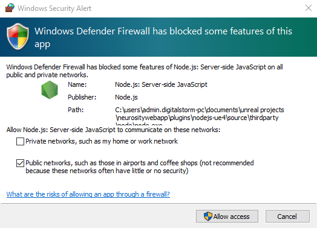

# Configuración del Entorno
La configuración del entorno es un paso esencial que abarca la instalación de los componentes necesarios para desplegar el proyecto como recurso principal. Se requiere un servidor local para poder desplegar un servicio web en tu red local.

## Contenido:
- [Node.js](./Config_environment.md#instalación-de-nodejs)
- [Verifica tu Instalación](./Config_environment.md#verifica-tu-instalación)
- [Uso Básico](./Config_environment.md#uso-básico)

## Instalación de Node.js
Como requisito inicial, necesitarás un servidor web, por lo que este proyecto se despliega en Node.js. Puedes descargar Node.js desde la siguiente página:

> [Descargar Node.js](https://nodejs.org/en/download/)

- Una vez completada la descarga, ejecuta el programa y selecciona "Instalar".
- Aparecerá una ventana de bienvenida. Haz clic en "Siguiente".
- Luego, se mostrarán los términos y condiciones en pantalla (se recomienda leerlos). Haz clic en "Siguiente".
- Se te recomienda dejar la configuración de localización por defecto.
- Finalmente, haz clic en "Instalar". Cuando termine la instalación, selecciona "Cerrar" o "Finalizar".

## Verifica tu Instalación
Para verificar que Node.js y NPM (Node Package Manager) se han instalado correctamente, abre el Command Prompt o PowerShell y escribe los siguientes comandos, luego presiona Enter:

```shell
node -v
```
Deberías ver la versión de Node.js instalada. Luego, verifica la versión de NPM con este comando:

```shell
npm -v
```

## Uso Básico
Node.js es un framework que interpreta comandos que le envías. Para probar tu instalación, puedes crear un script de prueba siguiendo estos pasos:

- Abre tu editor de preferencia.
Copia y pega este [código](./App/app.js):
    ```javascript
    var http = require('http');
    http.createServer(function (req, res) {
    res.writeHead(200, {'Content-Type': 'text/html'});
    res.end('Hello World!');
    }).listen(8080);
    ```
- Guarda el archivo como '**app.js**', asegurándote de recordar la ruta de almacenamiento.
- Abre la consola de comandos en la ubicación donde se encuentra el archivo 'app.js' y ejecuta el siguiente comando:
    ```
    node app.js
    ```
- Dado que el script se ejecuta en segundo plano, abre un navegador web y entra la siguiente dirección en la barra de navegación:
    > http://localhost:8080

- Deberías ver el texto "Hello World!".

> **Nota**
>
> En algunos casos, al intentar acceder externamente, es posible que aparezca una ventana emergente que, al dar acceso, permite la conexión a través de Node.js.
>
>
